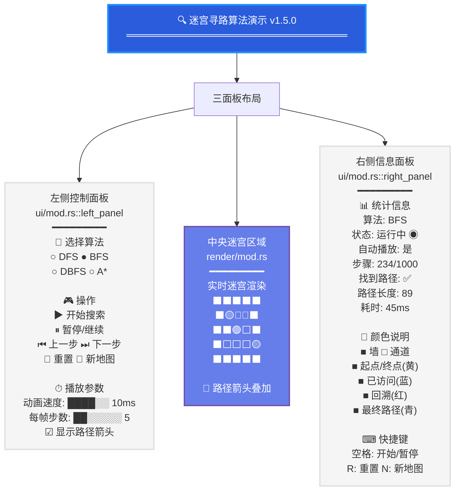

# 迷宫寻路算法 (Rust)

<div align="center">

**使用 Rust + egui 构建的迷宫生成与寻路可视化工具**


</div>

---

## ✨ 功能特性

- 🏗️ **Kruskal + 并查集** 生成完美迷宫（保证起点到终点有唯一解）
- 🔍 四种经典寻路算法：DFS / BFS / DBFS / A*
- 🎬 逐步可视化搜索过程，支持前进/后退
- ⚡ 可调节动画速度，批量步进提升效率
- 🖥️ 原生 GUI，无需浏览器或外部运行时

---

## 🚀 快速开始

### 环境要求

- Rust 1.70+（推荐通过 [rustup](https://rustup.rs/) 安装）

### 构建 & 运行

```bash
# 克隆或进入项目目录
cd maze-routing-algorithm-rust

# 编译并运行（Release 模式）
cargo run --release --bin maze-gui
```

---

## 🎮 操作说明

### 快捷键

| 按键 | 功能 |
|------|------|
| `Space` | 开始 / 暂停搜索 |
| `R` | 重置地图（保留迷宫） |
| `N` | 生成新迷宫 |
| `←` / `→` | 单步后退 / 前进 |
| `1` `2` `3` `4` | 切换算法：DFS / BFS / DBFS / A* |
| `+` / `-` | 加速 / 减速动画 |
| `Esc` | 退出 |

### 颜色图例

| 颜色 | 含义 |
|------|------|
| ⬛ 黑色 | 墙壁 |
| ⬜ 白色 | 通道 |
| 🟡 黄色 | 起点 / 终点 |
| 🔵 天蓝 | 已访问 |
| 🔴 浅红 | 回溯 |
| 🟢 青绿 | 最终路径 |

---

## 📂 项目结构

```
src/
├── main.rs          # GUI 入口
├── lib.rs           # 库导出
├── config/          # 常量配置（地图尺寸、颜色等）
├── core/
│   ├── map.rs       # 地图生成（Kruskal + 并查集）
│   └── point.rs     # 坐标 & 颜色定义
├── alg/
│   ├── dfs.rs       # 深度优先搜索
│   ├── bfs.rs       # 广度优先搜索
│   ├── dbfs.rs      # 双向 BFS
│   └── astar.rs     # A* 启发式搜索
├── render/          # 纹理渲染 & 路径绘制
├── ui/              # 控制面板 & 状态显示
└── input/           # 键盘快捷键处理
```

---

## 🧠 算法简介

| 算法 | 特点 | 最优路径 | 时间复杂度 |
|------|------|:--------:|------------|
| **DFS** | 深入优先，快速但路径可能较长 | ❌ | $O(V+E)$ |
| **BFS** | 层级扩展，保证最短路径 | ✅ | $O(V+E)$ |
| **DBFS** | 双向同时搜索，相遇即结束 | ✅ | $O(V+E)$ |
| **A*** | 启发式 $f=g+h$，高效且最优 | ✅ | $O(E \log V)$ |

> $V$：节点数，$E$：边数；A* 使用曼哈顿距离作为启发函数。

---

## 🛠️ 迷宫生成

采用 **Kruskal 最小生成树 + 并查集（路径压缩 + 按秩合并）** 算法：

1. 将所有单元格初始化为墙
2. 奇数坐标 $(2k+1, 2j+1)$ 作为潜在通道
3. 随机打乱相邻单元格之间的墙
4. 逐墙判断：若两侧单元格不连通，则打通该墙并合并集合
5. 最终生成无环的完美迷宫

---

## 🖼️ 界面布局

基于 `ui/mod.rs` 实现的三面板布局设计（egui 即时模式 GUI）：

<details>
<summary><strong>点击展开界面布局</strong></summary>



</details>

**布局说明（源码映射）：**

| 区域 | 源码位置 | 尺寸 | 功能 |
|------|---------|------|------|
| **顶部标题栏** | `ui/mod.rs::top_bar()` | 全宽 | 显示程序标题、版本号 |
| **左侧控制面板** | `ui/mod.rs::left_panel()` | 230px | 算法选择、操作按钮、播放参数 |
| **中央迷宫区域** | `render/mod.rs::sync_texture()` | 自适应 | 迷宫纹理渲染、路径箭头叠加 |
| **右侧信息面板** | `ui/mod.rs::right_panel()` | 230px | 统计信息、颜色说明、快捷键提示 |

**交互控件详解：**

<table>
  <tr>
    <td width="50%">
      <strong>左侧控制面板（230px 宽）</strong>
      <ul>
        <li><strong>选择算法</strong><br/>RadioButton 组，支持 DFS/BFS/DBFS/A* 四选一</li>
        <li><strong>操作按钮</strong><br/>开始搜索、暂停/继续、上一步、下一步、重置、新地图</li>
        <li><strong>播放参数</strong><br/>
          • 动画速度滑块 (Slider)：1-100 ms/步<br/>
          • 每帧步数滑块：1-50 步/帧<br/>
          • 显示路径箭头复选框 (Checkbox)
        </li>
      </ul>
    </td>
    <td width="50%">
      <strong>右侧信息面板（230px 宽）</strong>
      <ul>
        <li><strong>统计信息</strong><br/>实时显示当前算法、运行状态、步骤进度、路径长度、耗时</li>
        <li><strong>颜色说明</strong><br/>彩色方块 + 文字标签，对应 6 种网格状态</li>
        <li><strong>快捷键提示</strong><br/>快速参考表（空格、R、N、←/→）</li>
      </ul>
    </td>
  </tr>
</table>

---

## ⚖️ 与 C++ Qt 版本对比

| 对比项 | C++ / Qt6 | Rust / egui |
|--------|-----------|-------------|
| **语言** | C++17 | Rust 2021 |
| **GUI 框架** | Qt6 Widgets | egui (即时模式 GUI) |
| **渲染方式** | QPainter 逐帧绘制 | GPU 纹理 + 即时模式 |
| **线程模型** | QThread 多线程搜索 | 单线程预计算 + 批量步进 |
| **内存管理** | 手动 new/delete | 所有权系统自动管理 |
| **构建工具** | XMake / CMake | Cargo |
| **依赖管理** | 手动或 vcpkg | crates.io 自动拉取 |
| **跨平台支持** | 需分别配置工具链 | `cargo build` 原生支持 |
| **可执行体积** | ~15 MB (含 Qt DLL) | ~3 MB (静态链接) |
| **迷宫生成算法** | Prim 随机生成 | Kruskal + 并查集 |
| **热键处理** | Qt 信号槽机制 | egui Input 事件轮询 |
| **中文字体支持** | QString 原生 | 内嵌 TTF 字体文件 |

### 性能与优势对比

| Rust 版本优势 | C++ 版本优势 |
|---------------|--------------|
| ✅ 无运行时依赖，开箱即用 | ✅ 成熟的 Qt 生态、丰富文档 |
| ✅ 内存安全，无数据竞争风险 | ✅ 多线程搜索更灵活可控 |
| ✅ 编译即优化，性能接近 C++ | ✅ IDE 支持完善（Qt Creator） |
| ✅ 增量编译快，开发效率高 | ✅ 更丰富的预设 UI 组件库 |
| ✅ 跨平台最小化配置 | ✅ 企业级应用成熟度高 |

---

## 📜 许可证

MIT License

